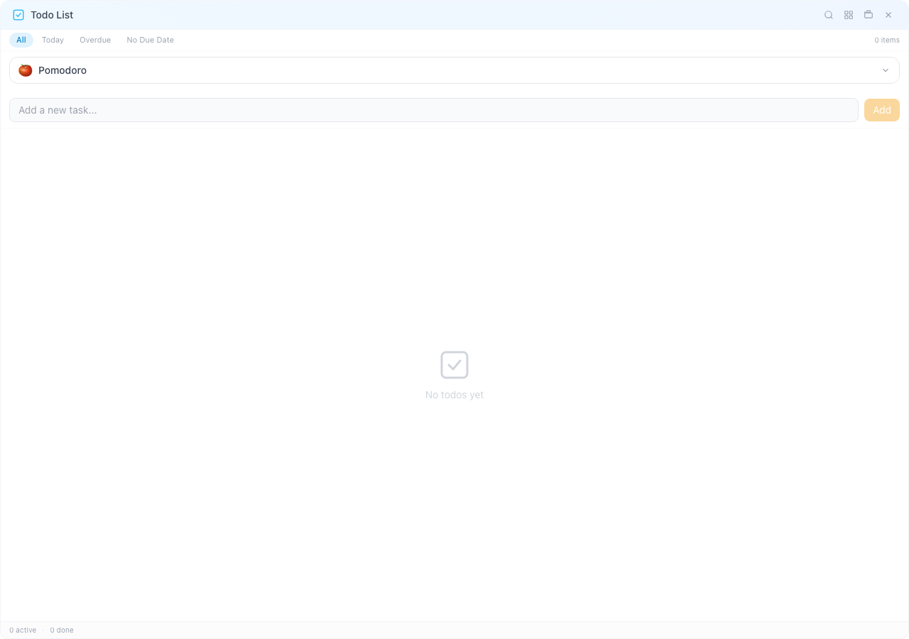
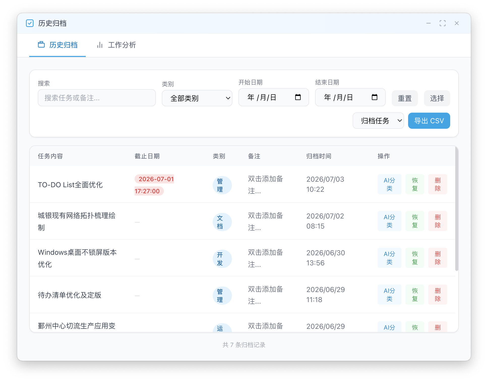
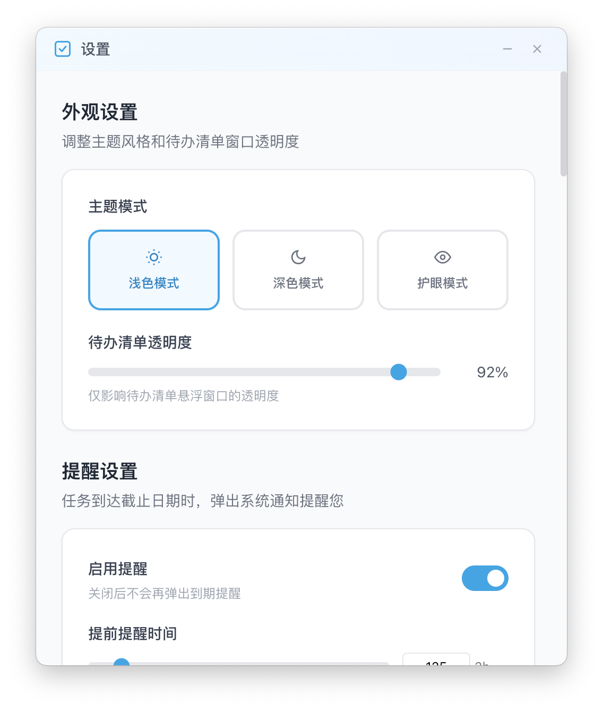

# TodoFloat — 好用的桌面待办清单，始终悬浮，极速捕获灵感

一款轻量级桌面悬浮待办清单，集任务管理、AI 自动分类、工作效率分析和番茄钟于一体。

---

## 快速开始

1. 在 [GitHub Releases](https://github.com/NBSmalltree/todo-app/releases) 页面下载最新版本（当前 v2.1.0）：
   - **macOS**：选择 `.dmg` 安装包（适配 Apple Silicon 和 Intel 芯片）
   - **Windows**：选择 `.msi` 或 `.exe` 安装程序
2. 安装并启动，应用会常驻在菜单栏（macOS）或系统托盘（Windows）。
3. 默认全局快捷键：**Cmd+Shift+T**（macOS）/ **Ctrl+Shift+T**（Windows）即可显示/隐藏悬浮窗口。

---

## 功能介绍

### 1. 任务管理

这是你每天使用最频繁的核心功能——添加、整理、完成你的待办事项。

- **添加任务**：在底部输入框中输入内容，按 **回车键** 即可添加。
- **完成任务**：点击任务左侧的复选框，任务会被标记为已完成。
- **编辑任务**：双击任务文字即可直接编辑。
- **删除/归档**：右键点击任务可唤出菜单，也可以开启批量模式多选后统一操作。
- **颜色优先级**：点击任务左侧的颜色圆点，可循环切换颜色——红色（紧急）、橙色（重要）、黄色（中等）、绿色（低优先级）、无色（默认）。
- **子任务**：点击任务上的展开箭头，可以添加子任务，进度条会直观展示完成比例。
- **拖拽排序**：通过拖拽手柄自由调整任务顺序。
- **已完成折叠**：已完成的任务会自动收起到"已完成 N 项"区域，保持列表清爽。

### 2. 快速添加

按下 **Cmd+Shift+Space**（macOS）或 **Ctrl+Shift+Space**（Windows），会弹出一个类 Spotlight 的快速输入窗口。输入任务后按回车，无需切换到主窗口就能瞬间记录灵感。按 **Esc** 关闭窗口。

### 3. 筛选与搜索

窗口顶部提供了快捷筛选：**全部 | 今天 | 已过期 | 无截止日期**，点击即可切换视图。

按 **Cmd+F**（macOS）或 **Ctrl+F**（Windows）打开搜索面板，每项都会显示截止日期状态。在归档视图中还支持按分类筛选。

### 4. 截止日期与未来日程

- **设置截止日期**：点击任务的日历图标，可以设置精确到小时的截止时间。
- **视觉提示**：已过期的任务显示为红色，今天截止的显示为黄色。
- **未来日程**：设置一个未来的截止日期，任务会自动隐藏，等到那天才出现。适合用来安排还未到期的计划。
- **清除日期**：在日期选择器中点击"清除"按钮，可以随时移除截止日期。

### 5. 番茄计时器

内置番茄工作法计时器，支持专注、短休息和长休息三种模式。

- **关联任务**：可以直接对某个任务开启专注计时，计时器上会显示当前任务名称。
- **可视化反馈**：圆��� SVG 进度环随剩余时间动态变化，底部用圆点显示当前轮次。
- **系统通知**：每个阶段结束时系统会弹出通知，提醒你暂停或开始休息。
- **状态同步**：计时器状态在悬浮窗口、托盘视图和设置界面中同步。

### 6. 归档与 CSV 导出

已完成的任务会进入历史归档。通过系统托盘菜单即可打开。

- **筛选**：支持按关键词搜索、下拉选择分类、指定日期范围。
- **批量操作**：可多选任务，统一进行还原或删除。
- **CSV 导出**：导出自定义范围的数据——活跃任务、已归档任务或全部。筛选条件也会应用于导出。
- **撤销操作**：误删或误归档？底部会弹出 5 秒的撤销通知，点击即可恢复。
- **AI 自动分类**：如果配置了 AI API 密钥，任��在归档时会自动归类。

### 7. 工作分析与 AI

顶部按钮可以在**周视图**、**月视图**和**年视图**之间切换。

- **概览卡片**：活跃任务数、已归档数量、分类数量、完成率。
- **图表**：分类分布的饼状图和每日任务量的柱状图。
- **分类明细**：展示各分类的占比、进度条。
- **番茄钟统计**：总专注时长、每日专注面积图、近期计时记录。
- **AI 分析**：配置 AI 后，会针对所选时间范围生成 Markdown 格式的效率分析与建议。每个时间段的分析结果独立计算且会缓存。

### 8. 设置

通过系统托盘菜单打开，或按 **Cmd+,**（macOS）/ **Ctrl+,**（Windows）。

- **主题**：在外观设置中切换浅色、深色或护眼模式（暖黄光）。
- **透明度**：拖动滑块调节悬浮窗口的不透明度（0.3 - 1.0）。
- **语言**：在外观设置中一键切换中文/英文。
- **提醒**：开启或关闭任务提醒，设定提前通知时间（0 - 1440 分钟），支持测试通知功能。
- **全局快捷键**：显示/隐藏窗口和快速添加均支持录制模式——点击输入框后按下你想要的按键组合即可录制。
- **番茄钟设置**：分别调整专注时长、短休息、长休息，以及进行多少次专注后进入长休息。
- **AI 服务商**：填写 API 密钥、接口地址和模型名称。点击"测试连接"可以验证配置是否正确，无需保存。支持 OpenAI、Anthropic、DeepSeek、智谱等所有与 OpenAI 接口兼容的服务商。
- **数据管理**：支���将数据备份为 `.db` 文件，也可通过备份文件恢复数据（恢复操作会覆盖当前数据，系统会先弹出确认对话框）。

### 9. 系统集成

- 常驻 **macOS 菜单栏**（无 Dock 图标）或 **Windows 系统托盘**。
- 右键托盘图标可快速操作：**显示 Todo / 历史归档 / 设置 / 退出**。
- 窗口**记住位置和大小**，重启后自动恢复。
- **滚轮缩放**：按住 **Cmd**（macOS）或 **Ctrl**（Windows）滚动鼠标滚轮，可缩放悬浮窗口（0.3x - 2.5x）。
- **四角拖拽**：拖拽窗口任意一角即可调整大小。
- 视觉主题（浅色/深色）独立于系统设置运行。
- **自动数据库迁移**：首次启动时会自动检测并迁移 v1.x Electron 版本的数据库。

---

## 技术栈

| 层级 | 技术方案 |
|------|---------|
| 前端 | React 18 + Vite + Tailwind CSS + Recharts |
| 后端 | Rust + Tauri v2 + SQLite (rusqlite) + reqwest |
| AI | 兼容 OpenAI API 接口（OpenAI、Anthropic、DeepSeek、智谱等） |
| CI/CD | GitHub Actions — 每打 `v*` 标签时自动构建 `.dmg`（macOS arm64 + x86_64）和 `.msi`/`.exe`（Windows） |

---

## 常见问题

**如何让窗口始终置顶？**  
悬浮模式下默认就是置顶的，不需要额外设置。

**可以离线使用吗？**  
可以。所有数据都存在本地的 SQLite 数据库中。

**我的数据安全吗？**  
所有数据只存储在本地电脑上。如果需要备份，可以在设置中使用数据导出功能。

**如何从 v1.x Electron 版迁移数据？**  
首次启动时会自动完成迁移。系统会检测到旧版数据库并自动迁移到新位置，你不需要做任何操作。

---

## 参与贡献与许可

本项目基于 [MIT License](LICENSE) 开源。

有任何问题或建议，欢迎在 [GitHub Issues](https://github.com/NBSmalltree/todo-app/issues) 上反馈。
